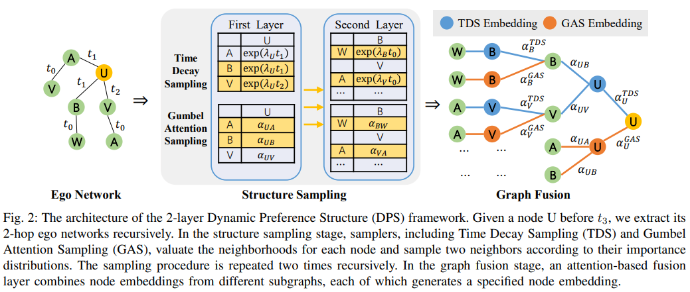
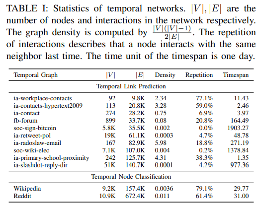

- [Dynamic-Preference-Structure (ICBK 2021)](#dynamic-preference-structure-icbk-2021)
  - [## Introduction](#-introduction)
  - [## Experiments](#-experiments)
    - [Requirements](#requirements)
    - [Dataset Statistics](#dataset-statistics)
    - [Data Preprocess](#data-preprocess)
    - [Temporal Link Prediction](#temporal-link-prediction)
    - [Temporal Node Classification](#temporal-node-classification)
  - [## Cite us](#-cite-us)

# Dynamic-Preference-Structure (ICBK 2021)

Authors: Tongya Zheng, Zunlei Feng, Yu Wang, Chengchao Shen, Mingli Song*, Xingen Wang, Xinyu Wang, Chun Chen, Hao Xu

Code for [Learning Dynamic Preference Structure Embedding From Temporal Networks](https://arxiv.org/abs/2111.11886), which is highly inspired by [Inductive Representation Learning on Temporal Graphs](https://github.com/StatsDLMathsRecomSys/Inductive-representation-learning-on-temporal-graphs).

## Introduction
---
The dynamics of temporal networks lie in the continuous interactions between nodes, which exhibit the dynamic node preferences with time elapsing.
The challenges of mining temporal networks are thus two-fold: the dynamic structure of networks and the dynamic node preferences.

In this paper, we investigate the dynamic graph sampling problem, aiming to capture the preference structure of nodes dynamically in cooperation with GNNs. 
Our proposed Dynamic Preference Structure (DPS) framework consists of two stages: structure sampling and graph fusion.
In the first stage, two parameterized samplers are designed to learn the preference structure adaptively with network reconstruction tasks.
In the second stage, an additional attention layer is designed to fuse two sampled temporal subgraphs of a node, generating temporal node embeddings for downstream tasks.



## Experiments
---

### Requirements
- python==3.7
```
numpy==1.20.3
pandas==1.3.5
scipy==1.7.3
scikit-learn==1.0.1
numba==0.52.0
cvxpy==1.1.17
torch==1.5.0
tqdm=4.62.3
dgl==0.6.1
```

### Dataset Statistics

You can download datasets from [Google drive](https://drive.google.com/drive/folders/19ItQ4G64rYa6so1IQ6NxEq_Ok7K9Sqsp?usp=sharing) and place the `format_data` under the `data` directory. We will split them into training, validation, and testing datasets in the next section.



We use temporal networks without node/edge features from [network repository](http://networKrepository.com/ia.php) for temporal link prediction, and use `Wikipedia` and `Reddit` from [JODIE: Predicting Dynamic Embedding Trajectory in Temporal Interaction Networks](https://snap.stanford.edu/jodie/#datasets). We preprocess them into a unifed data format with the node columns including `node_id, id_map, role, label` where `role` indicates whether it is a user-item bipartite network, and the edge columns including `from_node_id, to_node_id, timestamp, state_label, feat0, ...` where both `from_node_id` and `to_node_id` are `node_id` in the node columns, `state_label` indicates whether the user was banned from the Wikipedia page or subreddit, and `feat0, ...` are preprocessed edge features.

For temporal link prediction, we remove unseen nodes in the training dataset from validation and testing dataset because previous embedding methods are not inductive. For temporal node classification, we remain the inductive training setting, and inherit most comparison results from [TGAT](https://arxiv.org/abs/2002.07962) and [APAN](https://arxiv.org/abs/2011.11545).

### Data Preprocess

```bash
bash init.sh
```
We use `init.sh` to make necessary directories for our experiments to store generated datasets by `data/*`, boost the training speed by `gumbel_cache` and `sample_cache`, record training details by `log`, record testing results by `results` and `nc-results`, save our trained models by `ckpt` and `saved_models`.

```bash
python data_unify.py -t datasplit
python data_unify.py -t datalabel
```
We use `-t datasplit` to split datasets into the training, validation and testing set according to the ratios.

Config flags for `data_unify.py`:
```
usage: Configuration for a unified train-valid-test preprocesser.
       [-h] --task {datastat,datasplit,datalabel} [--start START] [--end END]
       [--train-ratio TRAIN_RATIO] [--valid-ratio VALID_RATIO] [--label]

optional arguments:
  -h, --help            show this help message and exit
  --task {datastat,datasplit,datalabel}, -t {datastat,datasplit,datalabel}
  --start START         Datset start index.
  --end END             Datset end index (exclusive).
  --train-ratio TRAIN_RATIO, -tr TRAIN_RATIO
                        Train dataset ratio.
  --valid-ratio VALID_RATIO, -vr VALID_RATIO
                        Valid dataset ratio, and test ratio will be computed
                        by (1-train_ratio-valid_ratio).
  --label               Whether to generate negative samples for datasets.
                        Each labeled dataset will have a suffix
                        xxx_label.edges.
```


### Temporal Link Prediction
We use `optimal_alpha.py` and `gumbel_pretrain`

```bash
# `-t edge` means that we read data from splitted `data/[train/valid/test]_data`.
# optimal_alpha.py computes the Time Decay Sampler.
python optimal_alpha.py -t edge
# gumbel_pretrain.py computes the Gumbel Attention Sampler.
python gumbel_pretrain.py -t edge -d ia-contact --hard soft
# After sampler precomputation, we have `edge-ia-contact-alpha.npz` from optimal_alpha.py and `edge-False-ia-contact-gumbel-soft.pth` from gumbel_pretrain.py.
# We further compute `edge-False-ia-contact-gumbel-soft-10.pyc` and store it in `gumbel_cache` in fusion_edge.py.
python fusion_edge.py -t edge -d ia-contact
```

Config flags for `fusion_edge.py`, which mainly inherits the interface of `TGAT`.
```
optional arguments:
  -h, --help            show this help message and exit
  -d DATA, --data DATA  data sources to use
  -t {edge,node}, --task {edge,node}
  -f, --freeze
  --bs BS               batch_size
  --prefix PREFIX       prefix to name the checkpoints
  --n_degree N_DEGREE   number of neighbors to sample
  --n_head N_HEAD       number of heads used in attention layer
  --n_epoch N_EPOCH     number of epochs
  --n_layer N_LAYER     number of network layers
  --lr LR               learning rate
  --drop_out DROP_OUT   dropout probability
  --gpu GPU             idx for the gpu to use
  --node_dim NODE_DIM   Dimentions of the node embedding
  --time_dim TIME_DIM   Dimentions of the time embedding
  --agg_method {attn,lstm,mean}
                        local aggregation method
  --attn_mode {prod,map}
                        use dot product attention or mapping based
  --time {time,pos,empty}
                        how to use time information
  --uniform             take uniform sampling from temporal neighbors
  --alpha ALPHA         Sampling skewness.
  --hard {soft,hard,atte}
                        hard Gumbel softmax
  --temp TEMP
  --anneal ANNEAL
```

### Temporal Node Classification
```bash
# `-t node` means that we read data from splitted `data/format_data`.
python optimal_alpha.py -t node
python gumbel_pretrain.py -t node -d JODIE-wikipedia --hard soft -f
python fusion_edge.py -t node -d JODIE-wikipedia -f
# We use DPS model pretrained by fusion_edge.py to predict the temporal node states.
python fusion_node.py -t node -d JODIE-wikipedia
```
`-f` indicates whether we train the node embeddings. In the inductive training setting, we find freeze node embeddings brings better generalization performance. We set the default `freeze=True` in `fusion_node.py`.

Config flags for `fusion_node.py`, which mainly inherits the interface of `TGAT`.
```
optional arguments:
  -h, --help            show this help message and exit
  -d DATA, --data DATA  data sources to use
  -t {node}, --task {node}
  --val_time VAL_TIME
  --node_layer NODE_LAYER
  --balance
  --neg_ratio NEG_RATIO
  --binary              Only use source_node embedding or use the combined
                        embeddings.
  --non-freeze          whether train the node embeddings
  --bs BS               batch_size
  --prefix PREFIX       prefix to name the checkpoints
  --n_degree N_DEGREE   number of neighbors to sample
  --n_head N_HEAD       number of heads used in attention layer
  --n_epoch N_EPOCH     number of epochs
  --n_layer N_LAYER     number of network layers
  --lr LR               learning rate
  --drop_out DROP_OUT   dropout probability
  --gpu GPU             idx for the gpu to use
  --node_dim NODE_DIM   Dimentions of the node embedding
  --time_dim TIME_DIM   Dimentions of the time embedding
  --agg_method {attn,lstm,mean}
                        local aggregation method
  --attn_mode {prod,map}
                        use dot product attention or mapping based
  --time {time,pos,empty}
                        how to use time information
  --uniform             take uniform sampling from temporal neighbors
  --alpha ALPHA         Sampling skewness.
  --hard {soft,hard,atte}
                        hard Gumbel softmax
  --temp TEMP
  --anneal ANNEAL
```

## Cite us
---
```
@inproceedings{dps_icbk21,
    title={Learning Dynamic Preference Structure Embedding From Temporal Networks},
    author={Zheng, Tongya and Feng, Zunlei and Wang, Yu and Shen, Chengchao and Song, Mingli and Wang, Xingen and Wang, Xinyu and Chen, Chun and Xu, Hao},
    booktitle={12th IEEE International Conference on Big Knowledge},
    year={2021}
}
```